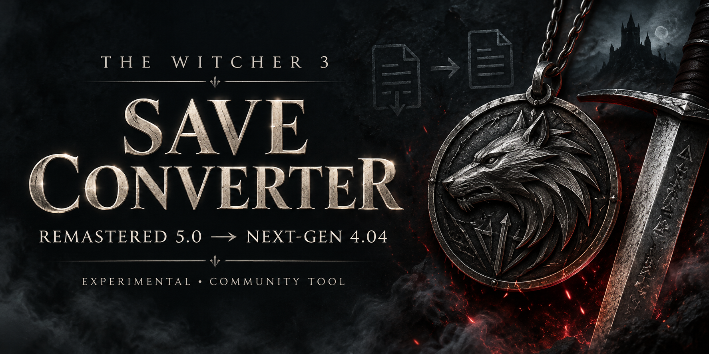

# Conversor de save do The Witcher 3 Remastered para Next-Gen



[](https://github.com/cahian/witcher3-remastered-to-nextgen-save-converter/actions/workflows/tests.yml)

Ferramenta experimental para converter um **save do Remastered 5.0 para o Next-Gen 4.04 da Steam**, incluindo campanhas iniciadas no Remastered. Ela adapta o inventário, gera um mod temporário a partir do seu próprio jogo e permite comparar o save resultante. O processamento é local.

**Um checkpoint real foi convertido e carregado novamente no Steam Deck, com o Next-Gen 4.04 sem o mod.** A compatibilidade atual é restrita: exige as três habilidades compradas `sword_s22`, `sword_s23` e `sword_s24`, todas no nível 1, com 1 ponto livre, 3 gastos e nenhuma mutação pesquisada. As compras são desfeitas, deixando **4 pontos disponíveis** para distribuir no Next-Gen. Outros perfis são recusados.

[English README](README.md) · [Procedimento completo](docs/workflow.md) · [Limitações](docs/limitations.md) · [Validação](docs/validation.md)

## Por que não basta trocar a versão

O save do Remastered contém diferenças no inventário e nas habilidades. Alterar apenas os números de versão pode permitir abrir o arquivo, mas deixar **Geralt sem corpo, com inventário ausente ou habilidades incompatíveis**. A conversão inclui essas estruturas e uma etapa de gravação pelo próprio jogo.

Foram observados o Remastered `5.0.1044392`, com cabeçalho `(66, 29, 164)`, e o Next-Gen `4.04`, com `(64, 27, 163)`. Isso não comprova compatibilidade com todas as versões 5.x, mods, saves de console ou o clássico 1.32.

## Instalação

Use Python 3.10 ou mais recente. Dentro do projeto:

```sh
git clone https://github.com/cahian/witcher3-remastered-to-nextgen-save-converter.git
cd witcher3-remastered-to-nextgen-save-converter
python3 -m venv .venv
. .venv/bin/activate
python -m pip install -e .
python -m w3save --help
```

No PowerShell do Windows, use `py -m venv .venv` e `.venv\Scripts\Activate.ps1`. O teste do jogo foi realizado no Steam Deck; a portabilidade do programa Python é uma verificação separada.

## Fluxo de conversão

Guarde uma cópia intacta do save e da pasta de saves. Use uma pasta de trabalho fora do repositório. Nos exemplos, ela é `../conversion` e já contém `input.sav`.

```sh
python -m w3save inspect ../conversion/input.sav
python -m w3save prepare ../conversion/input.sav --output ../conversion/candidate.sav
python -m w3save make-mod --game-script "/caminho/The Witcher 3/content/content0/scripts/game/gameplay/ability/PlayerAbilityManager.ws" --output-dir ../conversion/generated-mod
```

O comando `make-mod` exige o arquivo original da versão 4.04 reconhecida. O projeto não distribui esse arquivo do jogo. Instale o mod gerado, carregue o candidato em uma pasta de testes isolada e confira personagem, inventário, habilidades e missões. Depois crie um save nativo no próprio Next-Gen.

A etapa final também precisa de um save separado, criado no 4.04, com Ciri ainda sem habilidades compradas. Ele fornece as definições antigas de habilidades da Ciri; não substitui sua campanha.

```sh
python -m w3save finalize ../conversion/native.sav --reference ../conversion/reference-4.04.sav --output ../conversion/final.sav
python -m w3save audit ../conversion/input.sav ../conversion/final.sav
```

Remova o mod temporário, reinicie o jogo e carregue `final.sav`. Confira novamente corpo, equipamentos, itens, nível/XP, pontos e missões. O relatório sempre informa `runtime_validated: false`: a ferramenta analisa arquivos e não testa o jogo automaticamente.

Consulte o [procedimento completo](docs/workflow.md) para localizar saves, controlar a sincronização da Steam, usar o diagnóstico e salvar um checkpoint durante combate sem avançar a missão. Os comandos recusam sobrescrever arquivos existentes.

## Resultado e limites

O caso validado preservou 111 pilhas de itens, 232 coroas, nível 5, 64 XP, 4 pontos disponíveis e o estado esperado das missões. Geralt apareceu com corpo e equipamentos no carregamento final sem mod. O estado inativo da Ciri foi conferido estruturalmente; uma missão jogável da Ciri e uma campanha completa não foram testadas.

Este é um projeto independente, com código original de conversão. Não inclui saves, arquivos completos do jogo ou acesso remoto. Para relatar incompatibilidades, prefira a versão do jogo, o erro e um resumo de diagnóstico sem caminhos pessoais; não envie saves ou credenciais por padrão.
